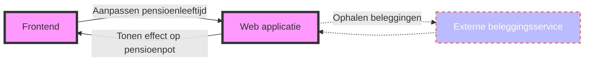

# Case sollicitatie developer BeFrank
### Hoi! :wave:
Leuk dat je solliciteert bij BeFrank! 
Deze opdracht is bedoeld om inzicht te krijgen in je vaardigheden als Java developer. 
De opdracht zal ongeveer 4 uur in beslag nemen en lijkt enigszins op een hackathon die we regelmatig bij BeFrank organiseren.  
Mocht je vast komen te zitten of merken dat je teveel tijd aan een bepaald onderdeel besteedt, probeer dan de simpelste oplossing die wel werkt te gebruiken. 
Zoek contact als je er echt niet uit komt. Het is niet de bedoeling om een productie-ready applicatie te maken.

De opdracht lever je in door de git repository met jouw oplossing op Github (of een andere service) aan ons beschikbaar te stellen.

### De opdracht :page_facing_up:
Je levert een front-end op voor een deelnemer bij BeFrank. Hierop is de verwachte waarde van de pensioenpot op de geplande pensioendatum te zien. 
De data voor dit front-end komt uit een java applicatie die hiervoor gegevens zal lezen uit een onderliggende database. 
Daarnaast maakt de applicatie gebruik van een REST koppeling met een externe beleggingservice om de huidige waarde van de beleggingsrekening op te halen. 
De deelnemer heeft de mogelijkheid om de verwachte pensioenleeftijd aan te passen en ziet dan het effect op de grootte van de pensioenpot op pensioendatum.



#### Data model
Een deelnemer bij BeFrank is een (ex-)werknemer bij een werkgever die een pensioenregeling heeft bij BeFrank.
Voor deze deelnemer hebben we in ieder geval NAW gegevens nodig, een e-mailadres en zijn geboortedatum.
De deelnemer heeft een dienstverband met zijn werkgever, waarbij zijn salaris bepaalt hoeveel pensioenpremie
maandelijks op de pensioenrekening wordt gestort. De pensioenrekening zelf is een beleggingsrekening die door
een externe partij wordt beheerd en waarvan we alleen het rekeningnummer hoeven vast te leggen.

#### Berekeningen :computer:
##### Jaarlijkse premie
Indien de deelnemer nog in dienst is bij de werkgever, dan zal maandelijks een premie gestort worden op de beleggingsrekening die afhankelijk is van:

- Full-time salaris
- Parttime percentage
- Franchise in de regeling (voor nu: vastgesteld op 15.599, -)
- Beschikbare premie percentage (voor nu: vast percentage van 5%)

De jaarlijkse premiestorting kan je berekenen met de volgende formule:

```(Full-time salaris – Franchise) * Parttime percentage * Beschikbare premie percentage```

Indien de deelnemer uit dienst is, dan wordt er geen premie meer gestort.

##### Verwachte waarde :moneybag:
De (vereenvoudigde) berekening van de verwachte waarde van de pensioenrekening is afhankelijk van de
volgende gegevens:
- Huidige leeftijd van de deelnemer
- Gewenste pensioenleeftijd van de deelnemer
- Huidige waarde van de beleggingen
- Jaarlijkse premie storting
- Jaarlijks rendement op de beleggingen (voor eenvoud van deze opdracht: vast rendement van 3%)

Voor ieder jaar tot aan het pensioen is de berekening van de verwachte waarde van de pensioenrekening gelijk aan:

```Huidige waarde + Jaarlijkse premiestorting + (Huidige waarde + Jaarlijkse premiestorting/2) * rendement```


#### Externe beleggingsservice
De beleggingsservice biedt een REST interface, die voor een gegeven rekeningnummer retourneert in welke
fondsen momenteel belegd wordt en wat de waarde per fonds is. De totale waarde van de beleggingsrekening is
de som van de waarde in de fondsen. Deze service hoeft niet volledig geïmplementeerd te worden, maar kan
vervangen worden door een mock API.

### Voorbeelden
#### Voorbeeld 1
Gegeven:
- Een deelnemer van 60 jaar oud
- En een huidige waarde van 100.000, -
- En een full-time salaris van 60.000, -
- En een part-time percentage van 80%
- En een franchise van 15.599, -
- En een beschikbare premie percentage van 5%
- En een rendement van 3% per jaar

Wanneer een gewenste pensioenleeftijd van 61 jaar wordt ingevuld  
Dan levert dit een verwachte waarde op pensioendatum van 104.802,68 euro

#### Voorbeeld 2
Gegeven:
- Dezelfde deelnemer als hierboven

Wanneer een gewenste pensioenleeftijd van 65 jaar wordt ingevuld  
Dan levert dit een verwachte waarde op pensioendatum van 125.498,08 euro

### Aan de slag!
Gebruik in het uitwerken van de case de volgende technieken:  
• Minimaal Java 11  
• Spring Boot  
• Angular  
• JPA  
• JUnit, Mockito

#### Heb je het afgerond?
Stuur dan de broncode en een korte beschrijving van je oplossing met een paar screenshots van de werkende
applicatie op. BeFrank zal de oplossing beoordelen en in je tweede gesprek kan je de gemaakte keuzes verder toelichten.

**:grey_question: Mocht je vragen hebben, schroom niet om contact op te nemen!**
